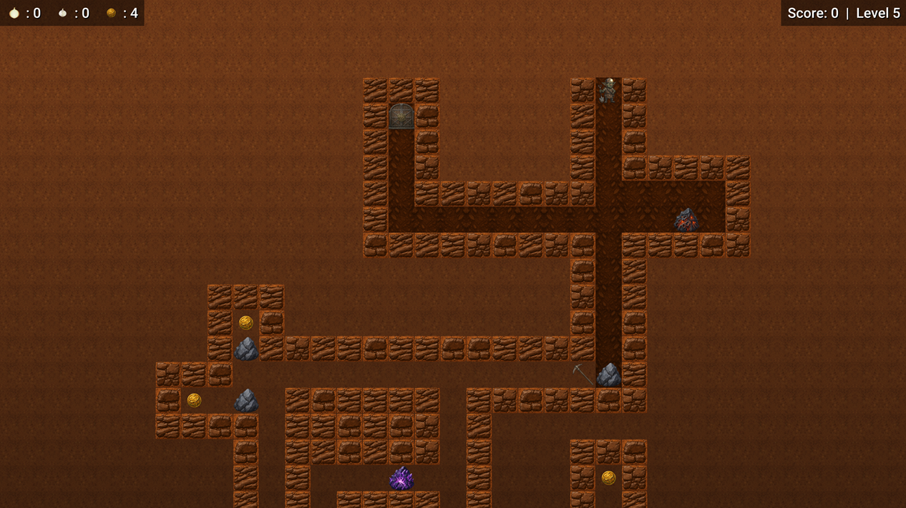

# ⛏️ DigX

<p align="center">
  
</p>

<p align="center">
  <b>An underground grid-based action puzzle game inspired by retro mine-exploration classics.</b>
</p>

<p align="center">
  
  
  
  
</p>

---

## 🌟 Overview

**DigX** is a grid-based underground action and puzzle game where you take control of a determined goblin miner exploring hazardous subterranean caverns. Dig through soil, gather glittering gold coins and rare diamonds, push heavy boulders, and use unconventional weapons to survive the subterranean perils!

> [!NOTE]  
> **DigX** is heavily inspired by the 2003 classic game **"Zworx"**, bringing back the beloved grid-digging, boulder-falling action puzzle gameplay with modern visuals, dynamic lighting, and custom C++ engine technology.

---

## ✨ Features

- ⛏️ **Grid-Based Tunnel Digging & Boulder Physics**: Dig out earth paths while watching out for heavy stone boulders that can roll down or crush unsuspecting miners and monsters alike.
- 🪙 **Gold & Objectives**: Collect all required gold coins scattered throughout each level to unlock the Exit Door and escape to the next challenge.
- 🧅 **Onion Fart Attack**: Eat collected onion bulbs to unleash explosive, enemy-blasting fart attacks!
- 🧄 **Garlic Breath**: Ingest garlic bulbs to breathe out pungent gas that repels vicious vampires and undead foes.
- ⛏️ **Equipment Upgrades**: Start with a basic shovel and upgrade to a high-speed **Pickaxe** to cut digging time in half.
- 💡 **Dynamic Fog of War & Lighting**: Navigate treacherous darkness using **Lamps** to temporarily reveal hidden diamonds and map layouts.
- 👾 **Underground Monster Roster**: Face off against Mummies, Soldiers, Vampires, and terrifying Dragons.
- ⚡ **Powered by ZWODEE Engine**: High-performance 2D engine built on **C++23** and **SDL3** featuring hardware-accelerated rendering, audio management, and Tiled level compiler integration.

---

## 📸 Screenshots

<p align="center">
  
  <br />
  <i>Level 5: Navigating deep tunnels, dodging boulders, and collecting gold.</i>
</p>

---

## 🎮 Controls

| Action | Primary Key | Secondary Key |
| :--- | :--- | :--- |
| **Move Up / Down / Left / Right** | <kbd>W</kbd> / <kbd>S</kbd> / <kbd>A</kbd> / <kbd>D</kbd> | Arrow Keys |
| **Onion Fart Attack** | <kbd>Space</kbd> | Action 1 |
| **Garlic Breath Repel** | <kbd>Left Shift</kbd> | Action 2 |
| **Pause / Game Menu** | <kbd>Escape</kbd> | <kbd>P</kbd> |

---

## 🎒 Items & Power-ups

| Item | Icon / Name | Description |
| :---: | :--- | :--- |
| 🪙 | **Gold Coin** | Primary currency. Collect required target coins to unlock the Exit Door. |
| 💎 | **Diamond** | High-value secret gemstone hidden in dark caverns. |
| ⛏️ | **Pickaxe** | Tool upgrade that significantly increases digging speed (40 ticks vs 90 ticks). |
| 💡 | **Lamp** | Temporarily illuminates the mine, unveiling hidden items in darkness. |
| 🧅 | **Onion Bulb** | Fuel for the explosive fart attack. Stuns and clears obstacles. |
| 🧄 | **Garlic Bulb** | Fuel for garlic breath to repel vampires and flying horrors. |
| 🚪 | **Exit Door** | Unlocks once all required gold is collected to progress to the next level. |

---

## 👾 Enemy Roster

- 🧟 **Mummy**: Triggered when miners step into nearby spawn regions. Moves steadily through tunnels.
- ⚔️ **Soldier**: Patrols mine corridors with high movement speed.
- 🦇 **Vampire**: Rapid creature vulnerable only to garlic breath and falling boulders.
- 🐉 **Dragon**: Elite underworld beast lurking in deep levels.

---

## 🛠️ Building & Running

### Prerequisites

- **C++23** compatible compiler (MSVC 2022+, GCC 13+, or Clang 16+)
- **CMake** 3.20 or newer
- **SDL3** development libraries
- **ZWODEE Engine** repository

### Build Instructions

1. **Set the `ZWODEE_ROOT` environment variable**:
   ```bash
   # On Windows (PowerShell)
   $env:ZWODEE_ROOT = "C:/path/to/zwodee"

   # On Linux / macOS
   export ZWODEE_ROOT="/path/to/zwodee"
   ```

2. **Configure with CMake**:
   ```bash
   cmake -B build -DCMAKE_BUILD_TYPE=Release
   ```

3. **Compile the executable**:
   ```bash
   cmake --build build --config Release
   ```

4. **Run DigX**:
   ```bash
   # On Windows
   ./build/bin/digx.exe

   # On Linux
   ./build/bin/digx
   ```

---

## 📜 Credits & Inspiration

- **Developer**: dexus1337
- **Inspiration**: Heavily inspired by the **2003 classic game "Zworx"**.
- **Engine**: [ZWODEE Engine](file:///c:/Users/PC/Documents/git/dexus1337/zwodee) built with **SDL3**.

---

<p align="center">
  Made with ❤️ by dexus1337
</p>
